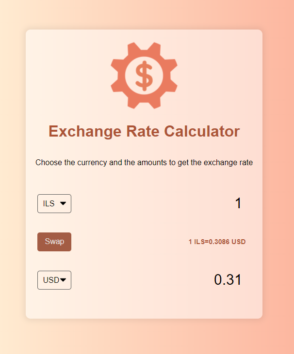

<h1 align="center">Exchange-Rate-Calculator</h1>

## Project Description

Select country currencies to get the exchange rate for a specific amount

## Built with

- HTML
- CSS
- JavaScript

## Links

- [Repo](https://github.com/AlmogWer/exchange-rate-calculator "Exchange Rate Calculator")
- [Live](https://almogwer.github.io/exchange-rate-calculator/ "Live View")

## Screenshots

## Author

- [Almogwer](https://github.com/almogwer)
- [Mail](mailto:Almogish@gmail.com?Subject=Hi% "Hi!")
- [Linkedin](https://www.linkedin.com/in/almogwertzberger/)
